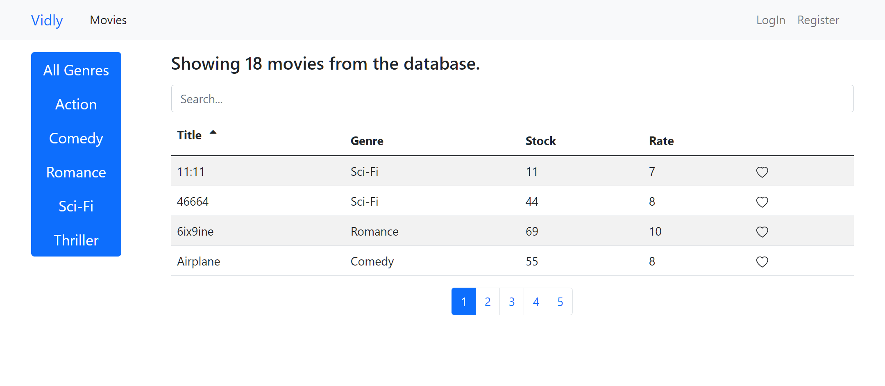
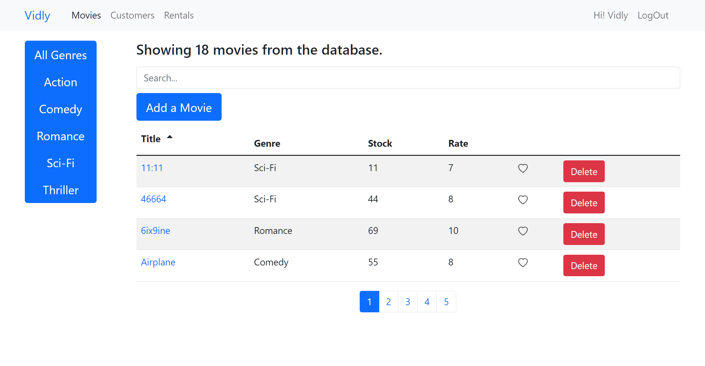
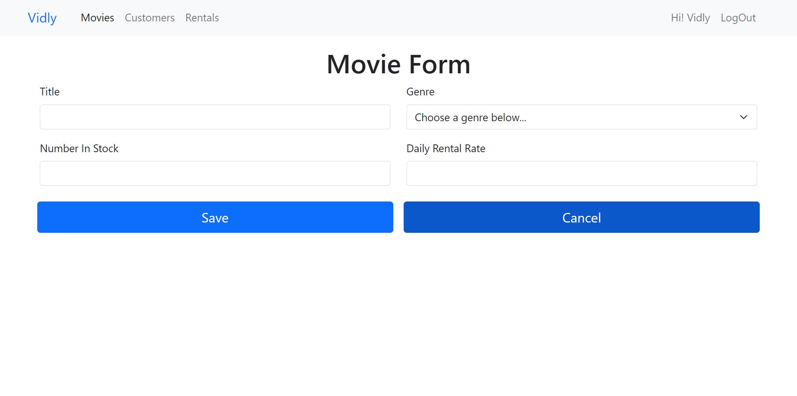
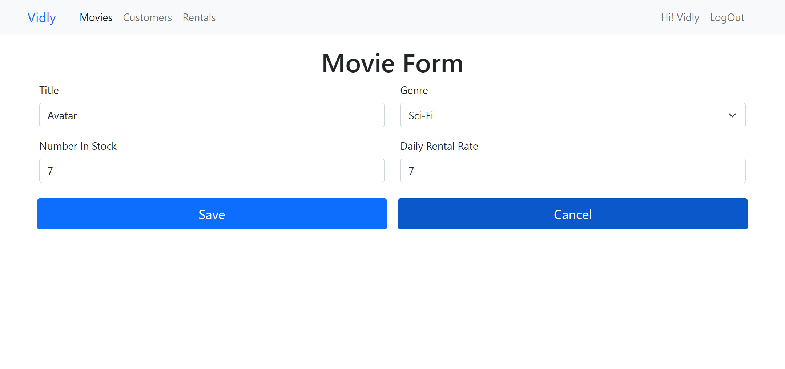
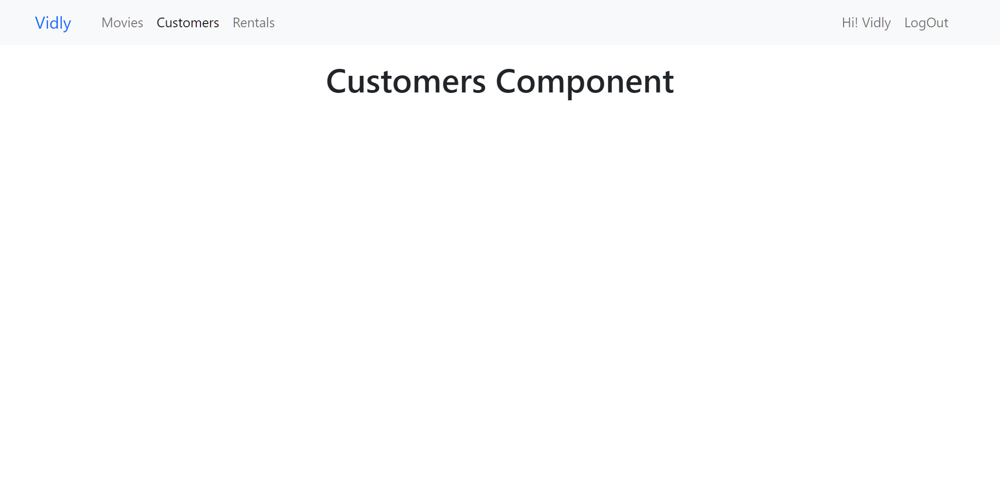
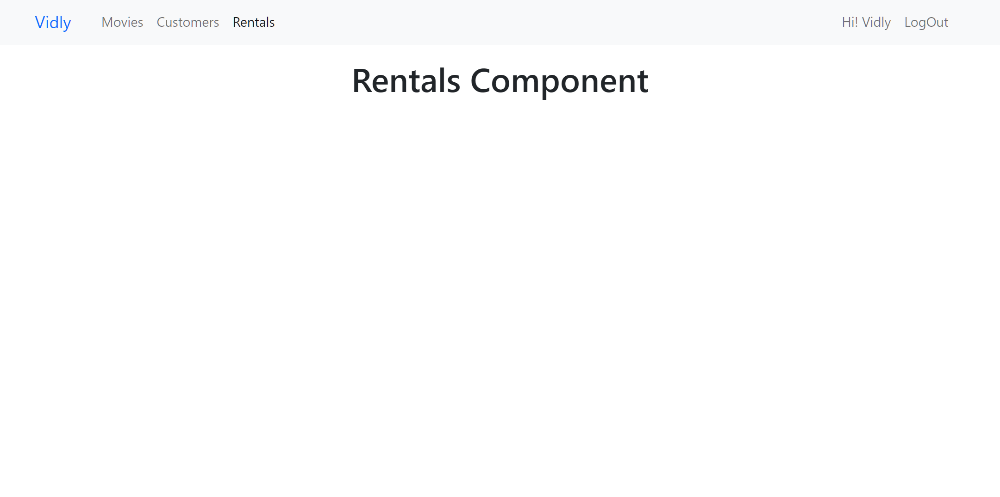
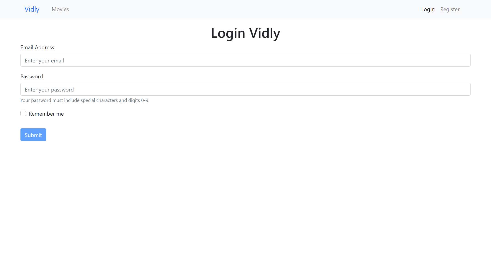
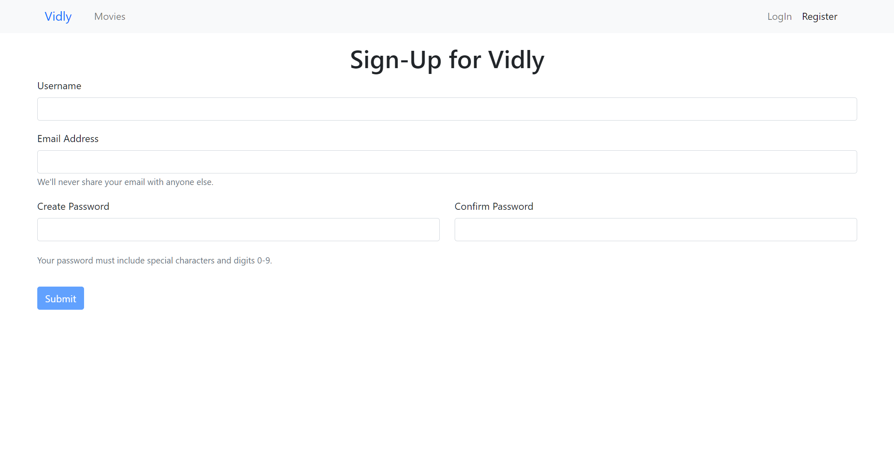

# [Vidley](https://vidley.vercel.app/)

## Table of Contents

- [vidley](#vidley)
  - [Table of Contents](#table-of-contents)
  - [Introduction](#introduction)
  - [Features](#features)
  - [Screenshoots](#screenshoots)
    - [Home Screen](#home-screen)
    - [Home Screen: For Registered Users](#home-screen-for-registered-users)
    - [Add New Movie Screen](#add-new-movie-screen)
    - [Edit Movie Screen](#edit-movie-screen)
    - [Customers Screen](#customers-screen)
    - [Rentals Screen](#rentals-screen)
    - [Signin Screen](#signin-screen)
    - [Signup Screen](#signup-screen)
  - [Run App On Local Machine Using Available Scripts](#run-app-on-local-machine-using-available-scripts)

## Introduction

Vidly is a small fictional movie web application built throughout the React course created by Mosh Hamedani aka Code with Mosh. This project was created to enhance React skills, including pagination, filtering, sorting, searching, and React routing. Including some full-stack development like CRUD operations, authentication, validation, and database management.

## What I have learned

- CRUD Operations: Managing customer, movie, and rental data.
- Frontend Technologies: Built using React with pagination, filtering, sorting, routing, and form validation.
- Authentication & Authorization: Secure user access, including login and registration.
- Development Tools: Utilizes Axios for API calls and Joi for validation.

## Features

- Home screen for non-signedin users
- Home screen for registered users
- Add a new movie in the platform
- Edit an existing movie in the platform
- Customers functionality
- Rentals functionality
- Signin functionality
- Signup functionality

## Screenshoots

### Home Screen

### Home Screen: For Registered Users

### Add New Movie Screen

### Edit Movie Screen

### Customers Screen

### Rentals Screen

### Signin Screen

### Signup Screen

## Run App On Local Machine Using Available Scripts

In the project directory from package.json, you can run:

### `npm start`

Runs the app in the development mode.\
Open [http://localhost:3000](http://localhost:3000) to view it in the browser.

The page will reload if you make edits.\
You will also see any lint errors in the console.

### `npm run build`

Builds the app for production to the `build` folder.\
It correctly bundles React in production mode and optimizes the build for the best performance.

The build is minified and the filenames include the hashes.\
Your app is ready to be deployed!

See the section about [deployment](https://facebook.github.io/create-react-app/docs/deployment) for more information.
